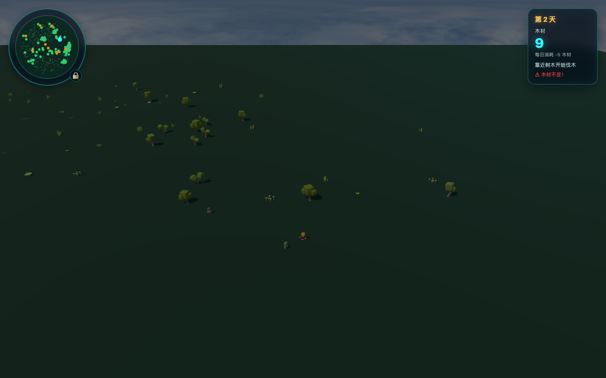

# 숲의 생존자 3D

<!-- repo-languages:start -->
한국어 | [English](README.md) | [简体中文](README-zh-CN.md)
<!-- repo-languages:end -->

<!-- repo-badges:start -->
[](https://nodejs.org)
[](https://pnpm.io)
[](https://nuxt.com)
[](https://vuejs.org)
[](https://threejs.org)
[](https://vite.dev)
[](https://www.typescriptlang.org)
[](https://sass-lang.com)
[](https://github.com/sigco3111/forest-survivor-3d/blob/HEAD/LICENSE)
<!-- repo-badges:end -->

> 이 저장소는 [shenzhepei/forest-survivor-3d](https://github.com/shenzhepei/forest-survivor-3d)의 **한글화 포크**입니다. 원본 코드를 그대로 유지하면서 한국어 UI 로케일(ko)을 추가했고, 모든 게임 메시지를 자연스러운 한국어로 옮겼습니다.

브라우저에서 즐기는 3D 숲 생존 게임입니다. 자동으로 움직이는 플레이어 에이전트가 나무를 모아 매번 찾아오는 추운 밤을 버텨야 합니다. 낮 동안 자원을 확보하지 못하면 게임 오버 — 간단한 규칙이지만, 순찰·경계·추적을 오가는 몬스터 AI가 매 판 긴장을 만듭니다.

**[🎮 지금 플레이하기](https://sigco3111.github.io/forest-survivor-3d/)**



---

## ✨ 주요 특징

- 🌲 **실시간 3D 숲 환경** — Three.js + WebGL로 렌더링되는 시네마틱 라이팅과 그림자
- 🪓 **자동 플레이어 에이전트** — 길찾기(pathfinding)·자동 이동·연속 벌목이 결합된 무인 플레이
- 👹 **몬스터 AI 행동 모델** — 순찰(`patrol`)·경계(`guard`)·추적(`chase`)·공격(`attack`) 상태를 FSM으로 전환
- 🌗 **낮과 밤 사이클** — 시간에 따라 변하는 디렉셔널 라이트 색온도와 강도
- 📦 **자원 관리** — 나무 채집, 매일 자정 소모, 생존 일수 누적, 부족 경고
- 🗺️ **미니맵 & 카메라 모드** — 우측 하단 미니맵, `🔒/🔓` 버튼으로 따라보기 ↔ 자유 시점 전환
- 🌍 **3개 언어 UI** — 한국어(기본) · English · 简体中文 즉시 전환, 선택은 로컬 스토리지에 영구 저장

## 🧩 기술 스택

| 영역 | 사용 기술 |
|---|---|
| 프레임워크 | **Nuxt 3.21.8** (SSR 대신 SPA 모드로 정적 생성) |
| UI 라이브러리 | **Vue 3.5.38** (Composition API + `<script setup>`) |
| 3D 엔진 | **Three.js 0.184.0** (PerspectiveCamera, GLTFLoader, SkeletonUtils) |
| 지형 노이즈 | **simplex-noise 4.0.3** (절차적 나무 분포) |
| 다국어 | **@nuxtjs/i18n 10.6.0** (strategy: `no_prefix`) |
| 빌드 | **Vite 7.3.5** |
| 언어 | **TypeScript 5.8.3** |
| 스타일 | **Sass 1.57.1** |
| 테스트 | **Vitest 4.1.10** (단위 테스트 8개 영역) |

## 🎮 게임 방법

1. 페이지가 로드되면 **플레이어 캐릭터가 자동으로 주변을 배회**하기 시작합니다.
2. 캐릭터가 나무에 가까이 가면 **벌목 게이지**가 자동으로 차오르고, 다 차면 나무 한 그루를 획득합니다.
3. **매일 자정**에 `woodPerDay`만큼 나무가 차감됩니다. 0 이하로 떨어지면 **게임 오버**.
4. 화면 우측 상단의 **언어 스위처**로 한국어 / English / 简体中文 사이를 즉시 전환할 수 있습니다.
5. 우측 하단 **🔒 버튼**으로 카메라를 따라보기 모드 ↔ 자유 시점(마우스 드래그 회전)으로 전환합니다.

## 🌐 다국어 지원 (i18n)

원본이 영어 + 중국어(간체) 두 가지를 지원했던 것을 **한국어를 추가해 3개 로케일**로 확장했습니다.

| 코드 | 언어 | 노출 위치 |
|---|---|---|
| `en` | English | `src/i18n/messages.ts`의 `en` 객체 |
| `zh-CN` | 简体中文 | `src/i18n/messages.ts`의 `'zh-CN'` 객체 |
| `ko` | 한국어 | `src/i18n/messages.ts`의 `ko` 객체 **(이 포크에서 추가)** |

**번역 키 구조**

```
meta.title          →  페이지 타이틀 (브라우저 탭)
meta.description   →  SEO 메타 설명
language.label     →  언어 선택 그룹의 aria-label
language.english   →  English 버튼 라벨
language.chinese   →  简体中文 버튼 라벨
language.korean    →  한국어 버튼 라벨
hud.day            →  일차 표시 (보간 {day})
hud.wood           →  나무 라벨
hud.dailyUse       →  매일 소모 (보간 {count})
hud.lowWood        →  부족 경고
hud.gameOver       →  게임 오버 힌트
hud.chopping       →  벌목 진행 (보간 {progress})
hud.approachTree   →  벌목 가능 안내
camera.free        →  자유 시점 버튼 title
camera.follow      →  따라보기 시점 버튼 title
gameOver.title     →  게임 오버 오버레이 제목
gameOver.survived  →  생존 일수 (보간 {days})
gameOver.exhausted →  게임 오버 사유 설명
gameOver.restart   →  재시작 버튼 라벨
```

선택한 로케일은 `localStorage['forest-survivor-locale']`에 저장되어 다음 방문에도 유지됩니다.

## 🛠️ 로컬 개발 환경

### 사전 요구사항

- Node.js **24 이상 25 미만** (`.nvmrc` 참고)
- pnpm **10.33.2**

### 설치 및 실행

```bash
# pnpm이 없다면
corepack enable
corepack prepare pnpm@10.33.2 --activate

# 의존성 설치 (postinstall에서 nuxt prepare 자동 실행)
pnpm install

# 개발 서버 시작 (http://localhost:4000)
pnpm dev
```

## 📦 빌드

```bash
# 프로덕션 빌드 (.output/)
pnpm build

# 정적 사이트 생성 (dist/)
pnpm generate
```

이 포크의 **GitHub Pages** 배포는 `pnpm generate`로 생성된 산출물을 `gh-pages` 브랜치로 푸시해 진행합니다.

## 🧪 테스트

```bash
# 단위 테스트 (Vitest)
pnpm test

# 커버리지 측정
pnpm test:coverage

# 빌드 후 무결성 검증
pnpm test:build
```

**현재 테스트 커버리지 영역** (`tests/unit/`):

- `language.test.ts` — 로케일 정규화·저장·복원
- `day-cycle.test.ts` — 낮/밤 사이클 FSM
- `lighting.test.ts` — 디렉셔널/헤미스피어/앰비언트 광원 컨트롤러
- `animations.test.ts` — 플레이어 애니메이션 컨트롤러
- `monsters.test.ts` — 몬스터 자원·AI 상태 전환
- `player-agent.test.ts` — 플레이어 자동 이동·충돌 회피·벌목
- `environment.test.ts` — 환경 오브젝트 배치·절차적 생성
- `trees.test.ts` — 절차적 나무 분포(simplex-noise 기반)

## 📂 프로젝트 구조

```
forest-survivor-3d/
├── src/
│   ├── app.vue                     # Nuxt 루트, useI18n으로 meta 동적 갱신
│   ├── components/
│   │   └── GameScene.client.vue    # 메인 게임 컴포넌트 (Three.js + HUD + 게임오버)
│   ├── game/
│   │   ├── player/                 # 자동 에이전트 + 애니메이션 컨트롤러
│   │   ├── resources/              # 나무, 환경, 몬스터 자원/스폰 로직
│   │   └── time/                   # 낮/밤 사이클 + 라이팅 컨트롤러
│   ├── i18n/
│   │   ├── messages.ts             # ★ en/zh-CN/ko 메시지 카탈로그
│   │   └── language.ts             # APP_LOCALES + localStorage 헬퍼
│   └── config.ts                   # 모든 튜닝 상수 (한 곳에 모음)
├── public/
│   ├── favicon.png / favicon.ico
│   ├── models/                     # GLB 캐릭터·몬스터·환경 모델
│   └── sky/                        # 스카이박스 텍스처
├── tests/unit/                     # Vitest 단위 테스트
├── docs/preview.webp               # README 게임플레이 미리보기
├── nuxt.config.ts                  # ★ ko 로케일 추가됨
├── i18n.config.ts                  # vue-i18n 런타임 설정
└── package.json                    # pnpm 매니페스트
```

## 🌗 라이선스 & 크레딧

- 본 저장소는 원본 저장소 [shenzhepei/forest-survivor-3d](https://github.com/shenzhepei/forest-survivor-3d)의 **MIT 라이선스**를 그대로 따릅니다 — 자유롭게 사용·수정·배포할 수 있습니다.
- 원본의 모든 게임 로직, AI 시스템, 3D 자산(glTF 모델·텍스처)은 원작자의 창작물입니다. 본 포크는 **UI 텍스트 번역과 한국어 로케일 추가**만을 변경했습니다.
- 원작자에게 ♥️ 한 잔의 커피를 사주고 싶다면 — [GitHub Sponsors @shenzhepei](https://github.com/sponsors/shenzhepei)에서 후원할 수 있습니다.

## 📜 변경 이력 (이 포크)

| 날짜 | 변경 |
|---|---|
| 2026-08-24 | 시드: 원본 클론, `ko` 로케일 추가 (메타/HUD/카메라/게임오버/언어 스위처 18개 키), 인라인 언어 버튼 3개를 i18n 키로 교체, 디버그 console 메시지 5건 한글로 정합, `nuxt.config.ts`에 `ko` 등록, README 한글로 전면 개편 |

---

**즐거운 생존 되세요 🌲⛏️**
